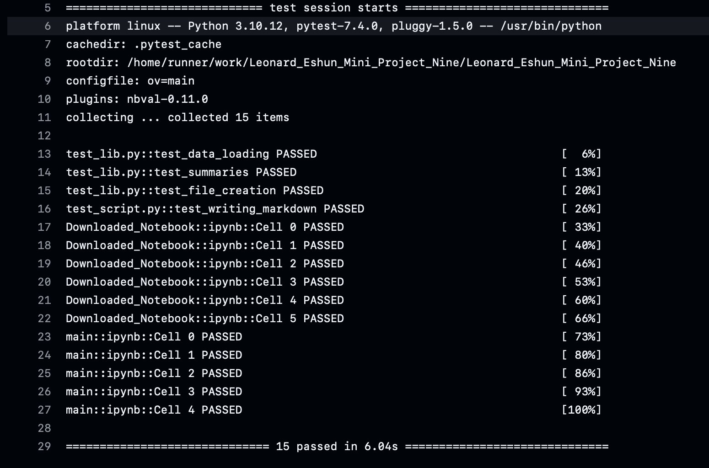

[](https://github.com/nogibjj/Leonard_Eshun_Mini_Project_Nine/actions/workflows/format.yml)
[](https://github.com/nogibjj/Leonard_Eshun_Mini_Project_Nine/actions/workflows/test.yml)
[](https://github.com/nogibjj/Leonard_Eshun_Mini_Project_Nine/actions/workflows/lint.yml)
[](https://github.com/nogibjj/Leonard_Eshun_Mini_Project_Nine/actions/workflows/install.yml)


## Data Engineering Mini Project Nine

This repository is created to fulfill an assignments in the Data Engineering course, IDS 706. The aim is to create 
1. Cloud-Hosted Notebook .
1. Perform Data Manipulation.

## Google Colab Link
The Jupyter Notebook was hosted at Google Colab and the link can be found below:   
[Google Colab Link to Jupyter Notebook](https://colab.research.google.com/drive/1z7n6Kh3i_gyrFDlgFQk_zKyxmyB82Z7m?usp=sharing)    

I download the Jupyter Notebook during CI from Google Colab into my repository as `Downloaded_Notebook.ipynb` for testing with nbval during CI:   


The data used was the Urbanization Census from Five Thirty Eight. This can be found at:    
[Link to data used for this project](https://raw.githubusercontent.com/fivethirtyeight/data/master/urbanization-index/urbanization-census-tract.csv)

**The requirements are:**    
1. Python script using Pandas for descriptive statistics
1. Read a dataset (CSV or Excel)
1. Generate summary statistics (mean, median, standard deviation)
1. Create at least one data visualization

**The assignment has two parts, which are:**   
1. The project structure must include the following files:
1. Jupyter Notebook with: 
	1. Cells that perform descriptive statistics using Pandas.
	1. Tested by using nbval plugin for pytest
1. Makefile with the following:
	1. Run all tests (must test notebook and script and lib)
	1. Formats code with Python black Links to an external site.
	1. Lints code with Ruff Links to an external site.
	1. Installs code via:  pip install -r requirements.txt
	1. test_script.py to test script
	1. test_lib.py to test library
	1. Pinned requirements.txt
1. Github Actions performs all four Makefile commands with badges for each one in the README.md  


## This is what the python code does
It has the following functions:

1. **load_dataset** to read the dataset using Pandas
	```
	# Returns a data frame
	load_dataset()
	```
1. **calculate_summaries** to generate the summary statistics
	```
	# Returns a data frame
	calculate_summaries(data, column_one, column_one_heading, column_two, column_two_heading, set_first_column_index=False)
	```
1. **create_bar_chart** to create bar charts for visualization
	```
	# This either saves the chart as a file or displays it depending on the value of _save_chart_
	create_bar_chart(data: pd.DataFrame, save_chart: bool)
	```
1. **create_histogram** to add histograms for visualization
	```
	# This either saves the chart as a file or displays it depending on the value of _save_chart_
	create_histogram(data, column, title, save_chart: bool)
	```
1. **save_to_markdown(data)** to create a markdown file after a git push by github actions
	```
	# This creates and saves a markdown file with the results
	save_to_markdown(data)
	```


## Descriptive Statistics and Visualization
The descriptive statistics were done with Pandas and the Visualization done with matplotlib.

## Here are some of the results of the descriptive statistics

### _Population Summaries:_
|    | Statistic          |   Population |   Urban Index |
|---:|:-------------------|-------------:|--------------:|
|  1 | Count              |     73280    |  73280        |
|  2 | Mean               |      4426.17 |     11.042    |
|  3 | Median             |      4126    |     11.6169   |
|  4 | Max                |     65528    |     14.9972   |
|  5 | Min                |         2    |     -0.297768 |
|  6 | Standard Deviation |      2198.08 |      2.08191  |

### _Population Histogram_


### _Population Bar Chart_


## Steps taken to meet the requirements
The code was pushed to Github and Github Actions did the following main things:

1. Setup the virtual environment according to the parameters in the workflow.yml
1. Packages were installed, including those in the requirements.txt file
1. All python files were formated by black
1. All the tests in the test_main.py were executed. The `make test` command gave this output:   


5. A markdown file summarizing the information is created during the pipeline runtime using Python. Prior to this the charts are generated in the pipeline runtime and used for visualization together with the descriptive statistics in the generated md file. This is part of the test workflow and occurs as the last job. A push is made by the github action for generation of the files.
