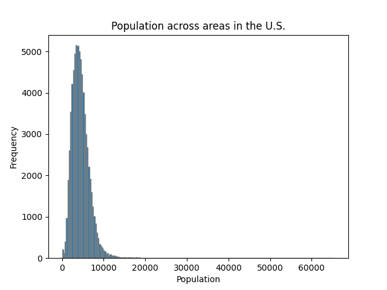
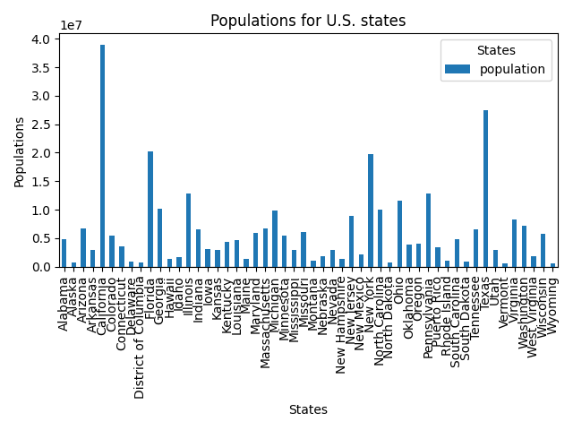

# Population Summaries
|    | Statistic          |   Population |   Urban Index |
|---:|:-------------------|-------------:|--------------:|
|  0 | Count              |     73280    |  73280        |
|  1 | Mean               |      4426.17 |     11.042    |
|  2 | Median             |      4126    |     11.6169   |
|  3 | Max                |     65528    |     14.9972   |
|  4 | Min                |         2    |     -0.297768 |
|  5 | Standard Deviation |      2198.08 |      2.08191  |

# Population Histogram

# Population Bar Chart

